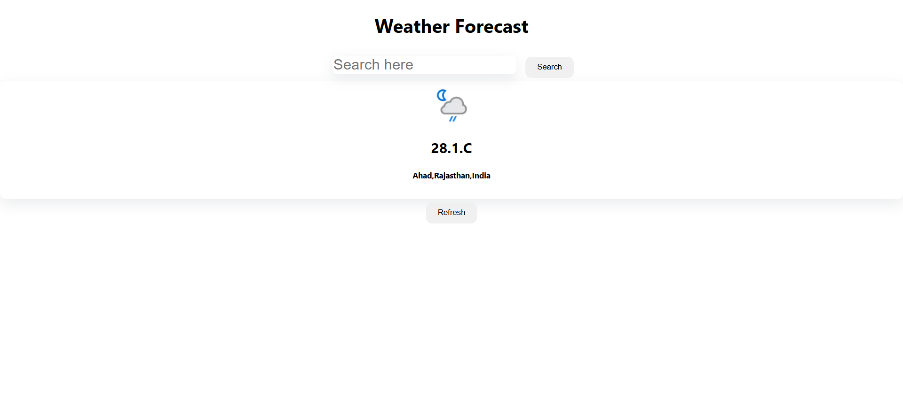

# Weather App

A simple React application to display current weather information for a searched city or your current location.

## Features

- Search weather by city name
- Get weather for your current location using geolocation
- Displays temperature, location, and weather condition icon

## Getting Started

### Prerequisites

- Node.js (v14 or higher recommended)
- npm

### Installation

1. Clone the repository:
   ```sh
   git clone <repository-url>
   cd weather-app
   ```
2. Install dependencies:
   ```sh
   npm install
   ```

### Running the App

```sh
npm start
```

The app will be available at [http://localhost:3000](http://localhost:3000).

## Project Structure

- `src/components/` - UI components (Button, Card, Input)
- `src/context/weather.jsx` - Weather context and provider
- `src/api/index.js` - API calls to weather service

# Weather App



## API

This app uses [WeatherAPI](https://www.weatherapi.com/) for fetching weather data.

## License

MIT